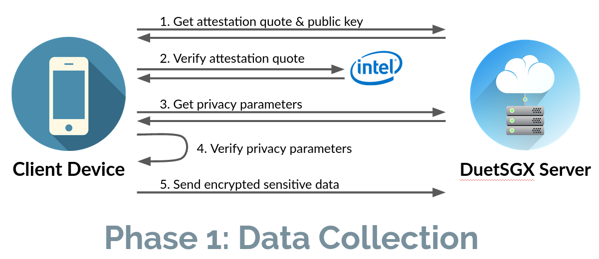
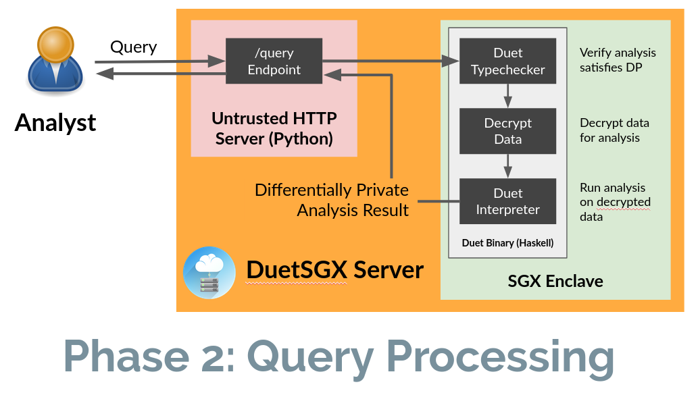

# DuetSGX

DuetSGX is a platform for collecting sensitive data and performing
differentially private queries on that data.

The data submitted to a DuetSGX server is encrypted, and integrity
and confidentiality are protected via an Intel SGX Trusted Execution
Environment (TEE).

DuetSGX requires that *all* queries satisfy differential
privacy. Raw data can *never* be extracted *by any party* from a
DuetSGX server.

To ensure that queries satisfy differential privacy, DuetSGX
performs static analysis on the query using the Duet system before
running the query.

## Table of Contents

- Overview of DuetSGX (this document)
- [Developing an Android app to collect DuetSGX data](client_setup.md)
- [Setting up a DuetSGX server](server_setup.md)
- [Issuing queries](queries.md)

## Background

### Differential Privacy

Differential privacy is a *formal privacy definition*. Informally,
differential privacy provides the following privacy protection for
each individual who participates in a differentially private data
analysis: **the outcome of the analysis will be roughly the same,
whether or not the individual's data is used in the analysis**. This
definition implies that individuals incur little additional risk to
their privacy when they participate in differentially private
analyses.

How close exactly do the outcomes need to be? (i.e. what does
"roughly" mean?) In the formal definition of differential privacy, the
"closeness" of outcomes is controlled by the *privacy parameters* ε
and δ, which together are sometimes also called the *privacy
budget*. Smaller values of ε and δ yield stronger privacy protection
(by tightening the definition of "roughly").

To achieve differential privacy, we typically add noise to things. One
common approach for an analysis with a single numeric result
(e.g. "how many people live in Vermont?") is to add noise drawn from
the Laplace distribution to the result of the analysis. This approach
is called the Laplace mechanism. Gaussian noise can also be used, and
many additional approaches have also been developed.

Much more information on differential privacy is available on the
[Wikipedia entry](https://en.wikipedia.org/wiki/Differential_privacy)
and in [The Algorithmic Foundationsof Differential
Privacy](https://www.cis.upenn.edu/~aaroth/Papers/privacybook.pdf) by
Dwork & Roth.

### Duet

Duet is a programming language and system for writing differentially
private programs and verifying that they satisfy differential
privacy. Duet is a functional language with static types that indicate
the privacy properties of the program. As part of the Duet project, we
have implemented a typechecker and interpreter. For a full description
of Duet, visit the [project
homepage](https://github.com/uvm-plaid/duet) or read our [OOPSLA 2019
paper](https://dl.acm.org/doi/10.1145/3360598).

### SGX

Intel's Software Guard Extensions (SGX) is a security feature present
on most of Intel's recent CPUs. SGX is one example of a [Trusted
Execution Environment
(TEE)](https://en.wikipedia.org/wiki/Trusted_execution_environment);
other examples include ARM TrustZone and AMD Secure Execution
Environment.

SGX allows programs to launch *enclaves*, which protect the
confidentiality and integrity of computation occurring within the
enclave - even from privileged software like the operating system. A
common use case is in outsourcing computation: a data owner might
encrypt some sensitive data, and use the services of an untrusted
cloud provider to compute on the data without revealing the data to
the cloud provider. This can be accomplished by launching an enclave
on the cloud provider's computer, decrypting and computing on the data
within the enclave, and encrypting the results before exiting the
enclave.

To protect against untrusted parties "faking" the presence of SGX, it
also provides *remote attestation* capabilities. Remote attestation
allows the CPU to produce a *quote* certifying that (1) the software
is running inside of an enclave on a legitimate SGX CPU, and (2) the
software has not been tampered with. The CPU constructs the quote by
computing a digest of the contents of the enclave and signing it using
a private key built into the CPU itself. Intel provides an
*attestation service* for verifying the authenticity of these quotes.

## Overview

DuetSGX has two major components: a client-side *data collection
library* and a server-side *query processing interface*. Use of
DuetSGX proceeds in two phases: (1) data collection, and (2) query
processing.

### Phase 1: Data Collection

In the first phase, client-side software communicates with the DuetSGX
server to contribute data. We have developed a client-side library for
Android devices running the Privacy-Enhanced Android (PEAndroid)
operating system for this purpose; the necessary functionality is
exposed by the DuetSGX server as a straightforward HTTP API, so
alternative clients are easily developed. More information on our
PEAndroid client, and how to integrate it into an Android app, is
available [here](foottraffic.md). 

The steps taken in contributing data are summarized in the figure
above, and are roughly as follows:

1. Communicate with the DuetSGX server to obtain its public key and an
   attestation quote to verify the legitimacy of the DuetSGX server.
2. Communicate the quote to Intel's SGX Attestation Service, to
   confirm that the attestation quote was generated by a genuine SGX
   processor running DuetSGX.
3. Verify that the attestation quote indicates that the correct
   DuetSGX server software is running on the server.
4. Communicate with the DuetSGX server to obtain the current setting
   of the privacy budget parameter, verify the signatures on those
   values, and check that the privacy parameters do not exceed the
   limits set by the application.
5. Encrypt the data item using the public key from (1) and send the
   encrypted data to the DuetSGX server.

This process is designed to ensure that data is encrypted before it's
sent to the server, and that it can only be decrypted and processed
inside of the SGX enclave running on the server.

### Phase 2: Query Processing

The second phase is processing differentially private queries over the
submitted data. Analysts write their queries using the
[Duet](https://github.com/uvm-plaid/duet) language and submit them to
the `/query` endpoint of the DuetSGX server. The server runs the query
and returns a differentially private result.

The steps taken during query processing are summarized in the above
figure, and are roughly as follows:

1. The (untrusted) Python HTTP server passes the query to the
   (trusted) Duet binary running inside the SGX enclave.
2. The Duet Typechecker verifies that the submitted query satisfies
   differential privacy, and derives the concrete values of ε and δ
   for the submitted query.
3. The Duet binary subtracts the ε and δ values from the global
   privacy budget.
4. The Duet Interpreter decrypts the data and runs the submitted
   query.
5. The result is returned through the Python HTTP server to the
   analyst.

More information on setting up the DuetSGX server, including how to
set up the initial values for the global privacy budget, is available
[here](setup.md). When the privacy budget is exhausted, the server
rejects all further queries.

### Web Interface

A simple web interface for inserting data and running queries is
provided by the DuetSGX server. When the server runs, it will output
(in the terminal) the location and port where the server is available
(usually `http://localhost:5000/`). Navigate to this address in a web
browser to use this interface. See [Issuing queries](queries.md) for
more.
